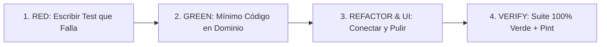

# Domain Integrity & Strict TDD Protocol — CarFleet

Este estándar establece el protocolo **obligatorio y no negociable** de análisis de dominio, diseño de invariantes y ejecución mediante TDD en el proyecto CarFleet.

> **Principio Rector:** Pensar y auditar la arquitectura antes de escribir código. El código es la parte más rápida y económica; corregir agujeros de dominio en producción o estar parchando bugs lógicos en caliente es el costo más alto.

---

## 1. El Checklist de Análisis de Dominio (Obligatorio Pre-Codificación)

Antes de crear o modificar cualquier entidad, Action o formulario, se debe responder formalmente a estos **6 pilares de integridad**:

### 1. Inconcurrencia Física (Physical Non-Concurrency)
* **Pregunta:** ¿Puede este actor o recurso físico estar en dos estados activos o dos servicios simultáneos en el mundo real?
* **Regla:** Si un recurso es finito o una persona física (chofer, vehículo), el sistema **debe bloquear** que participe en más de un evento activo en paralelo (`TripStatusEnum::EN_CURSO`, `VehicleStatusEnum::EN_VIAJE`, etc.).
* **Mecanismo:** Validación en la Action correspondiente (`StartTripAction`) y lanzamiento de excepción tipada (`DriverAlreadyInTripException`).

### 2. Colisión de Ventanas Temporales & Contención de Eventos Satélite (Time & Mileage Enclosure)
* **Preguntas:**
  1. ¿Puede asignarse un recurso a dos órdenes cuyas ventanas temporales se solapen?
  2. Si un registro satélite (tanqueo, gasto, peaje, incidente, evidencia) pertenece a un viaje o servicio, ¿sus marcas de tiempo y odómetro son coherentes con el rango físico del viaje?
* **Reglas:**
  * **Solapamiento de Intervalos:** Calcular siempre la intersección de intervalos $[S_1, E_1]$ y $[S_2, E_2]$:
    $$\text{Overlap} \iff (S_1 < E_2) \land (E_1 > S_2)$$
  * **Contención Espacio-Temporal de Eventos Satélite (Event Enclosure Boundary):**
    Todo evento o gasto vinculado a un servicio **debe ocurrir estrictamente dentro de los límites del servicio**:
    $$T_{\text{salida}} \le T_{\text{evento}} \le T_{\text{llegada (o now() si en curso)}}$$
    $$KM_{\text{salida}} \le KM_{\text{evento}} \le KM_{\text{llegada (si ya finalizó)}}$$
* **Mecanismo:** 
  * Asignación: Consulta preventiva en `AssignTripResourcesAction` con bloqueo pesimista (`lockForUpdate`) y `DriverScheduleConflictException`.
  * Eventos Satélite: Validaciones en `RegisterFuelLogAction`, `RegisterExpenseAction`, etc., lanzando `InvalidFuelDateException` o `InvalidFuelMileageException`.

### 3. Atomicidad de Agregados y Duplas Operativas (Coupled Resources)
* **Pregunta:** ¿La operación requiere más de un recurso conjunto para ser operacionalmente válida? (Ej: Vehículo + Conductor para despachar un viaje).
* **Regla:** Prohibidas las mutaciones o asignaciones parciales silenciosas. **O se asignan ambos o ninguno**.
* **Mecanismo:** 
  * En UI: Validación cruzada en tiempo real (`Select::requiredWith('other_field')`).
  * En Dominio: Excepción tipada (`IncompleteTripResourcesException`) si el DTO recibe un recurso huérfano.

### 4. Inmutabilidad de Máquinas de Estado & Herencia en Entidades Subordinadas (Inherited Immutability)
* **Pregunta:** ¿Cuáles son los estados terminales de la entidad (`cerrado`, `cancelado`, `baja`) y cómo afecta a sus registros dependientes?
* **Reglas:**
  * **Inmutabilidad del Agregado Raíz:** Todo registro en estado terminal es **estrictamente inmutable**. No se permiten reasignaciones, ediciones ni reaperturas sin un caso de uso explícito de reversión.
  * **Herencia de Inmutabilidad en Entidades Satélite (Inherited Immutability):**
    Si la entidad agregada principal (`Trip`) está en estado terminal (`CERRADO`, `CANCELADO`), **ningún registro hijo** (`FuelLog`, `TripEvidence`, `Expense`, `Incident`, `DigitalSignature`) puede ser editado ni eliminado.
    ```php
    public function isImmutable(): bool
    {
        return $this->trip?->isImmutable() ?? false;
    }
    ```
* **Mecanismo:** 
  * En Actions: Método `$model->isImmutable()` verificado al inicio de toda Action de creación/modificación (`TripImmutableException`).
  * En Modelos Eloquent: Hook `static::deleting` en `booted()` arrojando `TripImmutableException`.
  * En UI: Botones y acciones de edición/eliminación ocultos (`->visible(fn ($record) => !$record->isImmutable())`).

### 5. Teardown y Prevención de Estados Huérfanos (Lifecycle Cleanup)
* **Pregunta:** Si este registro se cancela, se reasigna o se elimina, ¿qué recursos dependientes quedan comprometidos?
* **Regla:** Ningún recurso secundario puede quedar bloqueado en un estado transitorio si la orden principal deja de existir.
* **Mecanismo:**
  * En Reasignación: Liberar el recurso anterior a `disponible` dentro de la misma transacción DB.
  * En Cancelación: Revertir recursos a `disponible` en la Action de cancelación.
  * En Eliminación: Hooks del modelo Eloquent (`static::deleting` en `booted()`) para garantizar liberación universal y limpieza de archivos en Storage.

### 6. Anti-Bypass de Dominio en UI (Filament / Livewire / API)
* **Pregunta:** ¿El formulario de Filament ejecuta un `$record->update()` o `$record->create()` crudo de Eloquent?
* **Regla:** **PROHIBIDO EL BYPASS DE ACCIONES EN UI**. Todo `CreateRecord` y `EditRecord` debe canalizar sus mutaciones a través de las **Actions de Dominio**.
* **Mecanismo:**
  * Sobrescribir obligatoriamente `handleRecordCreation(array $data)` en páginas `CreateRecord`.
  * Sobrescribir obligatoriamente `handleRecordUpdate(Model $record, array $data)` en páginas `EditRecord`.
  * Capturar las excepciones de dominio, notificar al operador con `Notification::danger()` y llamar a `$this->halt()`.
  * Sincronizar UI vs Payload: No confiar en máscaras CSS (`text-transform`), usar regex case-insensitive (`/i`) y sanitizar con `dehydrateStateUsing()`.

---

## 2. Protocolo TDD Estricto (Red — Green — Refactor)

La codificación debe respetar religiosamente este ciclo secuencial:



### Fase 1: RED (Escribir el Test Primero)
1. Redactar el test en `tests/Feature/{Area}/{Entity}ValidationTest.php` o `{Entity}ManagementTest.php`.
2. Modelar el caso límite o la invariante exacta (ej: chofer intentando salir 2 veces, placa en minúsculas, eliminación de registro satélite de viaje cerrado, fecha de tanqueo fuera de rango).
3. Correr `./vendor/bin/sail test --filter="nombre del test"` y **verificar que falla** con el error esperado (no por un error de sintaxis).

### Fase 2: GREEN (Implementar en el Dominio)
1. Crear la excepción de dominio tipada en `app/Exceptions/{Area}/{Name}Exception.php`.
2. Implementar la validación y transacción dentro de la **Action** correspondiente (`app/Actions/{Area}/...Action.php`).
3. Correr el test y verificar que pasa a **VERDE**.

### Fase 3: REFACTOR & UI INTEGRATION
1. Conectar las páginas de Filament (`CreateRecord`, `EditRecord`, `Actions` de tabla) con la Action de Dominio.
2. Añadir tests de Livewire simulando la interacción del formulario y verificando errores de validación (`assertHasFormErrors`) o ejecuciones exitosas (`assertHasNoFormErrors`).
3. Validar consistencia y feedback al usuario en español profesional.

### Fase 4: VERIFICATION
1. Correr toda la suite de pruebas: `./vendor/bin/sail test` $\rightarrow$ 100% de tests pasando en verde.
2. Formatear el código con el linter oficial: `./vendor/bin/sail pint`.
3. Revisar `git status` y verificar que no haya archivos huérfanos o sucios.

---

## 3. Matriz Rápida de Excepciones y Respuestas HTTP / UI

| Escenario de Inconsistencia | Tipo de Excepción | Comportamiento UI / Filament |
|---|---|---|
| Inconcurrencia / En curso | `DomainException` (ej: `DriverAlreadyInTripException`) | Modal detenido, notificación `danger()`, `$this->halt()` |
| Colisión de Horario | `DomainException` (ej: `DriverScheduleConflictException`) | Modal detenido, notificación `danger()`, `$this->halt()` |
| Desfase Temporal de Evento Satélite | `DomainException` (ej: `InvalidFuelDateException`) | Notificación `danger()`, `$this->halt()` |
| Desfase de Odómetro Satélite | `DomainException` (ej: `InvalidFuelMileageException`) | Notificación `danger()`, `$this->halt()` |
| Asignación Parcial | `DomainException` (ej: `IncompleteTripResourcesException`) | Formulario bloqueado con `requiredWith()` |
| Mutación o Eliminación Inmutable | `DomainException` (ej: `TripImmutableException`) | Botón/Formulario oculto (`isImmutable()`), `$this->halt()` |
| Recurso No Disponible | `DomainException` (ej: `VehicleNotAvailableException`) | Notificación `danger()`, `$this->halt()` |
