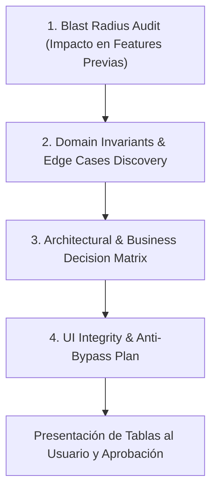

# Feature Architecture & Impact Audit — CarFleet

Este estándar establece el protocolo **obligatorio de auditoría pre-implementación** para cualquier nueva feature o modificación de features existentes en CarFleet.

> **Principio Rector:** *Concepts > Code*. Pensar, mapear dependencias y auditar la arquitectura antes de tocar cualquier archivo. Los tests son la red de seguridad, pero el **Análisis de Radio de Impacto** y el **Descubrimiento de Invariantes** evitan que los errores se introduzcan desde la concepción del diseño.

---

## Flujo de Trabajo Pre-Codificación

Antes de escribir la primera línea de código o test en una feature, el agente debe ejecutar secuencialmente estas 4 fases de análisis y entregar un reporte estructurado en tablas Markdown para validación del desarrollador:

---

## Fase 1: Análisis de Radio de Impacto (Blast Radius & Regression Audit)

Antes de crear o modificar componentes, se debe mapear el grafo de dependencias de los artefactos que serán tocados:

1. **Modelos Eloquent y Scopes:**
   - ¿Qué features previas (ej: F01 Vehículos, F02 Conductores, F03 Solicitantes, F04 Viajes) consumen este modelo?
   - ¿Agregar o modificar relaciones, scopes globales/locales o métodos en el modelo puede alterar el comportamiento de consultas existentes?
2. **Enums y Máquinas de Estado:**
   - ¿Agregar un nuevo caso (`enum case`) o renombrar estados impacta filtros de tablas Filament, badges, policies o transiciones de features ya terminadas?
3. **Esquema de Base de Datos y Migraciones:**
   - ¿Las nuevas columnas son `nullable` o tienen `default` seguro para no romper registros existentes?
   - ¿Se necesitan índices compuestos o restricciones de unicidad que puedan colisionar con datos de prueba o seeders?
4. **Firmas de Actions, DTOs y Servicios:**
   - Si se modifica una Action o DTO existente, ¿se preserva la retrocompatibilidad en todos los puntos de invocación (Controladores, Jobs, Filament Resources, Comandos)?
5. **Paneles y Recursos Filament:**
   - ¿El cambio impacta el Panel Admin (`/admin`), el Panel Driver (`/driver`) o futuros paneles?

### Formato Obligatorio — Tabla 1: Matriz de Radio de Impacto

| Componente a Modificar / Crear | Features / Módulos Afectados | Riesgo Potencial de Regresión | Estrategia de Preservación / Blindaje |
|---|---|---|---|
| *Ej: `Vehicle` Model & Enums* | *F01 (Vehículos), F04 (Viajes)* | *Cambio de estado puede hacer aparecer vehículos no aptos en selects de viaje* | *Mantener `scopeAvailable()` intacto y añadir scope específico `scopeEligibleForTrip()`* |

---

## Fase 2: Auditoría de Invariantes de Dominio y Edge Cases

Inspeccionar las especificaciones en `specs/features/XX-.../` (`requirements.md`, `design.md`) contrastándolas con la realidad física y operacional de la flota:

1. **Inconcurrencia Física:** ¿El recurso físico o humano puede duplicarse en dos estados o eventos en paralelo?
2. **Traslape Temporal:** ¿Existen rangos de fechas/horas que colisionen ($S_1 < E_2 \land E_1 > S_2$)?
3. **Recursos Acoplados (Duplas):** ¿Se exige asignación conjunta atómica (ej: vehículo + chofer) para evitar estados huérfanos?
4. **Inmutabilidad de Estados Terminales:** ¿El registro cerrado, cancelado o liquidado queda estrictamente protegido contra ediciones?
5. **Teardown y Limpieza de Recursos:** ¿Qué ocurre con recursos dependientes si la orden se cancela, reasigna o elimina (`SoftDeletes`)?
6. **Concurrencia Pesimista:** ¿Se requiere `lockForUpdate()` en transacciones críticas donde dos usuarios puedan seleccionar el mismo recurso a la vez?

### Formato Obligatorio — Tabla 2: Matriz de Edge Cases e Invariantes

| Escenario Límite / Edge Case | Comportamiento Esperado del Sistema | Excepción de Dominio Tipada | Mecanismo DB / Lock / Evento |
|---|---|---|---|
| *Ej: Asignar chofer con viaje en mismo horario* | *Bloquear asignación e informar conflicto horario* | `DriverScheduleConflictException` | `lockForUpdate()` + validación de traslape en Action |

---

## Fase 3: Matriz de Decisiones Arquitectónicas y de Negocio Pendientes

Identificar vacíos de requerimiento, ambigüedades o decisiones técnicas que no están explícitas en las specs y que requerirían refactorizaciones posteriores si no se aclaran de inmediato.

Cada decisión debe incluir la **Recomendación Senior** y su **Justificación Técnica**:

### Formato Obligatorio — Tabla 3: Matriz de Decisiones Pendientes

| # | Decisión / Dilema de Negocio | Riesgo si se Ignora | Recomendación Senior | Justificación Técnica & Alternativas |
|---|---|---|---|---|
| 1 | *Ej: ¿Qué hacer con el odómetro si el chofer ingresa un valor menor al actual?* | *Corrupción histórica de kilometraje del vehículo* | *Lanzar `InvalidMileageException` y bloquear guardado* | *Un odómetro físico no puede retroceder; previene fraude o error de digitación.* |

---

## Fase 4: Integración UI & Prevención de Bypass (Filament)

Verificar cómo interactúa la capa de presentación con el dominio:

1. **Canalización Obligatoria a Actions:** Asegurar que las páginas `CreateRecord` y `EditRecord` canalicen vía `handleRecordCreation()` y `handleRecordUpdate()`, sin ejecutar `$record->save()` crudo.
2. **Validación Cruzada en Tiempo Real:** Configurar `requiredWith()`, `live()`, `dehydrateStateUsing()` en campos acoplados.
3. **Manejo de Excepciones:** Interceptar excepciones de dominio, enviar `Notification::make()->danger()` y ejecutar `$this->halt()`.
4. **Protección de Campos Históricos:** Campos acumulativos o generados por eventos deben ser `disabled()` en formularios de edición estándar.

### Formato Obligatorio — Tabla 4: Checklist de Integridad UI

| Elemento / Formulario Filament | Riesgo de Bypass | Mecanismo de Blindaje UI |
|---|---|---|
| *Ej: Formulario Crear / Editar* | *Bypass de Action transaccional de dominio* | *Sobrescribir `handleRecordCreation` llamando a la Action con DTO y capturando `DomainException`* |

---

## Protocolo de Entrega al Usuario

Al iniciar el análisis de cualquier feature:

1. **Leer exhaustivamente** `specs/features/XX-.../` y los modelos/actions existentes.
2. **Generar las 4 Tablas de Auditoría** con precisión quirúrgica y fundamentación senior.
3. **DETENERSE y esperar el feedback/aprobación del usuario** sobre las decisiones pendientes antes de crear tests o código bajo [`domain-integrity-tdd`](../domain-integrity-tdd/SKILL.md).
